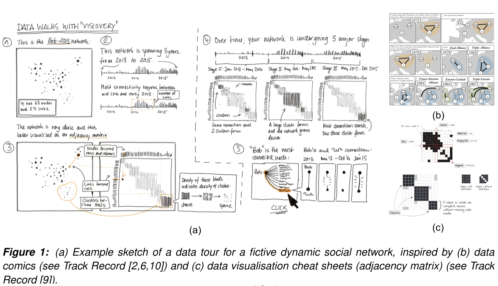

The Viscovery project is looking for a postdoc (up to 2 years) at the University of Edinburgh. 

## Project

This project aims to create a visualisation tool (*Viscovery*) that automatically guides novice-analysts through their data (networks), using methods from recommender systems and data-driven storytelling (e.g. [Data comics](datacomics.net)). The result will be a concept that mimics a human demonstrator/analyst walking domain scientists who are novel to data analysis through findings in their data. Our specific focus is to provide researchers in the humanities and network science with an effective way to learn novel interactive visualisation techniques for understanding complex geo-spatial and temporal networks. 

Our research will provide a better understanding of the feasibility and success of automatically presenting and walking novice analysts through their data. Results of our research include novel visualisation and interaction techniques, an open visualisation platform, design guidelines, evaluation results, open-source
code, case studies, design patterns, etc. Publications are aimed to be presented at top-tier international
conferences (CHI, VIS, EuroVis) and journals (TVCG).

The project is headed by [Benjamin Bach](http://benjbach.me) as th PI and is supported by a research engineer to help the postdoc focusing on research. W will collaborate with researchers in network analysis, archeology, and history in the UK and across Europe.

## Environment

The [VisHub](visualinteractivedata.github.io) an interdisciplinary visualization group comprising faculty, postdocs, PhD students, and master students in Design Informatics (winter to summer), organized by [Benjamin Bach](http://benjbach.me). The succesful candidate is encouraged to engage in both PhD and MSc supervision as well as teaching (extra pay). The School of Informatics at the University of Edinburgh is ranked 12th in the latest global QS rankings and offers many possiblities for interdiscipliny collaborations across the school and country. Edinburgh is a lovely international place amidst the Scottish nature and close to the wild Islands and Highlands. 

The PI will take personal care to help the postdoc with career planning, networking, and teaching relevant research skills relevant to the project and beyond (methodolgy, proposal writing, etc.).

## Organization

* **Start:** as soon as possible
* **Eligibility:** PhD in visualization or related areas
* **Fields of expertise/interest:** storytelling, network analysis, data comics, human-computer interaction, web-development
* **Duration:** up to 2 years

## Contact

For questions and application details e-mail [Benjamin Bach, bbach@ed.ac.uk](mailto:bbach@ed.ac.uk).

## Relevant References

* BACH, B., KERRACHER, N., HALL, K. W., CARPENDALE, S., KENNEDY, J., AND HENRY RICHE, N. Telling stories about dynamic networks with graph comics. In Proc. of ACM CHI (2016).
* BACH, B., WANG, Z., FARINELLA, M., MURRAY-RUST, D., AND HENRY RICHE, N. Design patterns for data comics. In Proc. of ACM CHI (2018).
* SCHÖTTLER, S., KAUER, T., AND BACH, B. Geographic network visualization techniques: A work-in- progress taxonomy. Computer Graphics (2019).
* WANG, Z., SUNDIN, L., MURRAY-RUST, D., AND BACH, B. Cheat sheets for data visualization tech- niques. In Proc. of ACM CHI (2020).
* BACH, B., STEFANER, M., BOY, J., DRUCKER, S., BARTRAM, L., WOOD, J., CIUCCARELLI, P., EN- GELHARDT, Y., KOEPPEN, U., AND TVERSKY, B. Narrative design patterns for data-driven storytelling. In Data-Driven Storytelling. AK Peters/CRC Press, 2018, pp. 125–152.
* BECK, F., BURCH, M., DIEHL, S., AND WEISKOPF, D. A taxonomy and survey of dynamic graph visualization. In Computer Graphics Forum (2017), vol. 36, Wiley Online Library, pp. 133–159.
* COHN, N. Visual narrative structure. Cognitive science (2013).
* CUI, Z., BADAM, S. K., YALÇIN, M. A., AND ELMQVIST, N. Datasite: Proactive visual data exploration
with computation of insight-based recommendations. Information Visualization (2019).
* HULLMAN, J., DRUCKER, S., RICHE, N. H., LEE, B., FISHER, D., AND ADAR, E. A deeper under-
standing of sequence in narrative visualization. IEEE TVCG (2013).
* KEY, A., HOWE, B., PERRY, D., AND ARAGON, C. Vizdeck: self-organizing dashboards for visual
analytics. In Proc. of ACM SIGMOD (2012).
* WANG, Y., SUN, Z., ZHANG, H., CUI, W., XU, K., MA, X., AND ZHANG, D. Datashot: Automatic
generation of fact sheets from tabular data. IEEE TVCG (2019).
* WONGSUPHASAWAT, K., MORITZ, D., ANAND, A., MACKINLAY, J., HOWE, B., AND HEER, J. Voyager:
Exploratory analysis via faceted browsing of visualization recommendations. IEEE TVCG (2015).

