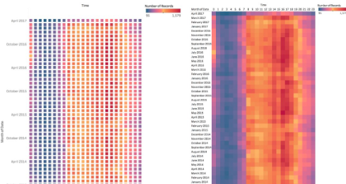
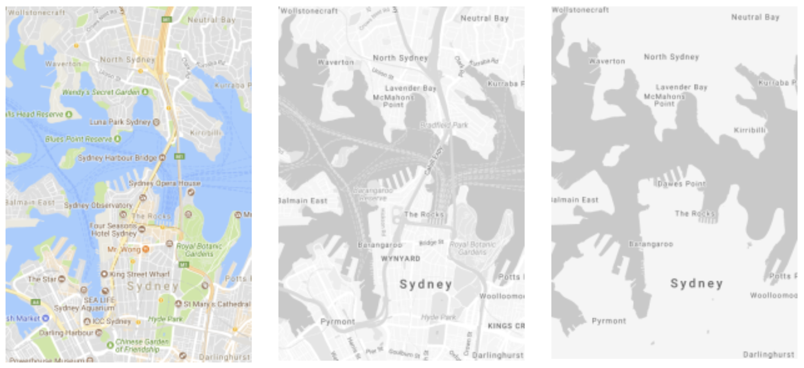
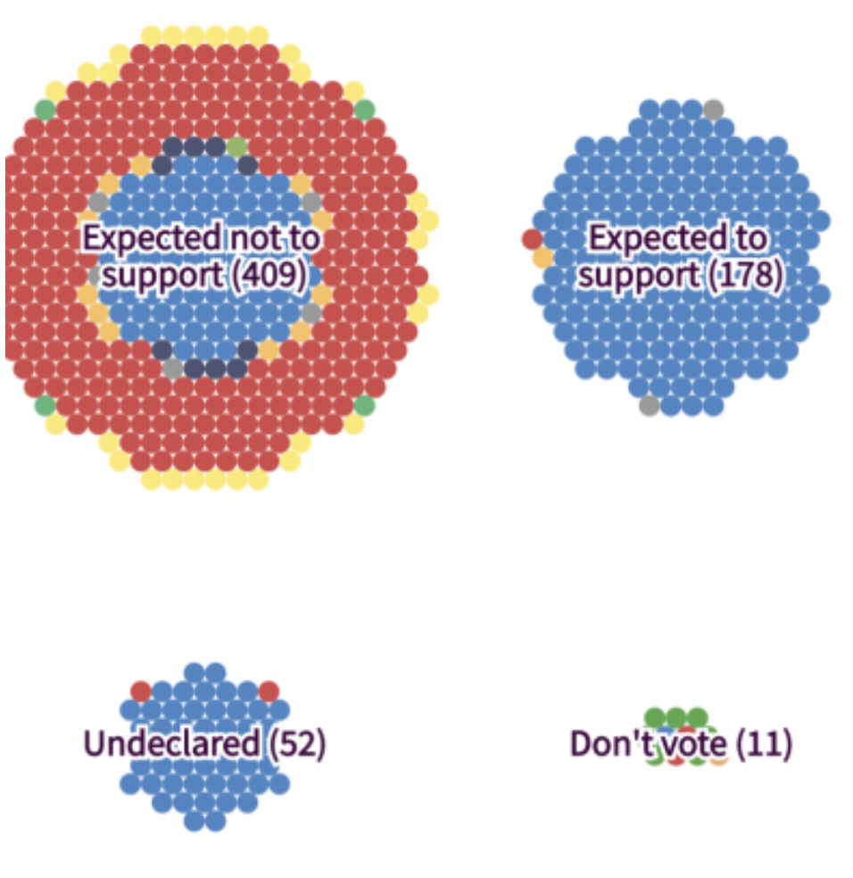

# Visualization Design 

### Visualization Design in a Nutshell
This part gives a brief yet growing introduction with some rules-of-thumb for beginners in information visualization. It’s a summary of discussions I am having with my students and includes information written more extensively elsewhere.
* Cole Nussbaumer: Storytelling with Data, http://www.storytellingwithdata.com/
* Alberto Cairo: The Functional Art, http://www.thefunctionalart.com/
* Andy Kirk: Visualizing Data: http://www.visualisingdata.com/about/
* John Maeda: The Laws of Simplicity: http://lawsofsimplicity.com
* Edward Tufte: Visual Explanations, https://www.amazon.co.uk/Visual-Explanations-Quantities-Evidence-Narrative/dp/1930824157
* Colin Ware: Information Visualization: http://www.ifs.tuwien.ac.at/~silvia/wien/vu-infovis/articles/book_information-visualization-perception-for-design_Ware_Chapter1.pdf

### Stages in Visualization Design
One way of thinking about visualization design is through the following four stages, which build onto each other though iterations are standard.
Conceptual design—this includes the required visualizations (network visualization, map, charts, .. ) and the interactions between them (zoom, filter, search, etc.. )
* Structural design—this defines the information that goes into each view/visualization and how the components are arranges. E.g. what type of layout for a node-link diagram, horizontal vs. vertical timeline, which visual marks to use to encode information, etc. .
* Visual mapping—once the visualization layout and structure are defined, the visual mapping decides how color, sizes, transparency, etc. are used to encode information.
* Graphical design—eventually, the visualization needs to be improved for clarity and visual simplicity. This involves choosing fonts and color palettes, placing and styling labels, adjusting transparencies, and adding explanations for users to understand the visualization.

The following lists some loose guidelines on what to take into account on each stage.

### Conceptual Design
* Simplicity—try to find the most simple version of your design possible. Don’t be afraid of removing elements if it helps making the visual design breath
Clarity—focus on the presented data and try to remove all visual ‘clutter’ that you do not need to visualize data or help understanding the data (scales, legends, labels, annotations etc..). The concept of clarity is related to Tufte’s notion of data-ink ratio.
* Need—focus on the purpose of the visualization. It is easy to try to visualize everything, but a well-crafted visualization supports a specific task. Think what you want your audience to take away from it or how they want to use it. What do they really need.
* Understandability—Provide sufficient legends and explanations for people to understand your visualization. This can include smaller captions, tooltips, as well as explicit explanations of the visual encoding (e.g. using an example). Tell people what they can see using your visualization.
* Multiple simple views vs. a single complex view—there’s a tradeoff between providing multiple specialized views (several barcharts), and integrate all information into a single visualization (e.g. stacked barchart). The choice should be made based on if the information is required to be seen together and needs to be relates (integration is probably a good choice). If the information can stay separate, probably separate visualizations are much clearer and simpler.
* Novelty vs. Classics—it sometimes can be necessary or tempting to create a novel, stunning visualization to attract attention and engage your audience. Novel visualization designs can help you solving a specific and tricky problem or to match the design to a specific audience or context. Keep in mind that not all novel designs are clear and understandable and that people need time to understand your novel visualization (the same holds for unusual visualizations that might be well known in a specific domain but not to your specific audience). On the other side, while classic charts might look a little boring, they convey in most cases a very clear message and are commonly understood. Starting from a classic chart, you can your journey to find ways to make them more attractive, more effective for your specific message, or adapt them to the complexity of your data.
 
### Structural Design

..pending

### Visual Mapping
..pending

**Color** 

Color is one of the most prominent visual variables to be used in visualization. With good use, you can create effective visualizations, but with bad use you can obtain quite the opposite.
The basic thing to know is that what we basically call ‘color’ is made up of three components:
* **Hue:** that’s the type of color such as red, blue, beige, sienna, etc.
* **Lightness/Brightness:** is the intensity of the color from dark to light: black, dark red, red, rosé, white
* **Saturation:** indicates how clean the color is and varies between gray and the most shiny version of a hue.

Here are some questions you want to ask yourself when using color in information visualization:

* Can I use color as a visual variable to encode information? Am I using color to encode information in my visualization? Or, am I using color to highlight individual elements in my visualization independent of their values (e.g. a hand-picked set of selected elements?).
* What type are the values I want to encode?:
** ordinal (values with a clear ordering from, e.g. low to high): Do I really use color here or rather shades of that color, i.e. changes in lightness or saturation? If I need may steps to discern, I could try a diverging color scale, i.e. one ranging from one color (blue) via some intermediate (yellow) to another color (red). There are drawbacks of this version and it should be used carefully. A good starting point to discover some examples is http://colorbrewer2.org (see below).
** categorical: this is the most prominent use of color as color can easily be used to provoke the impression of ‘equal’ elements without any specific order.
* How many values do I need to encode? The rule of thumb is that more than 5-7 becomes tricky for the human eye to discern, however metro maps can show up to 11 and beyond. If you need to encode more values that than, you probably need to find a smarter solution or draw inspiration from examples:
* Is there anything else I need color for in my visualization? You should use color for only one data dimension, i.e. to encode one type of information. Remember that color is a very prominent visual variable and will easily attract attention. In other words, use color for important information.
* Where to get a good color palette from. A good palette for information visualization defines colors that are perceptually discernable
** [http://projects.susielu.com/viz-palette](http://projects.susielu.com/viz-palette): Web tool for exploring color choices on several classic visualization examples
** [http://vrl.cs.brown.edu/color](http://vrl.cs.brown.edu/color): webtool to generate color palettes.
** [http://colorbrewer2.org](http://colorbrewer2.org): webtool with several pre-defined color palettes for both ordinal, diverging, and categorical data.

### Graphical Design
These guidelines can be seen as a little checklist. Go through them once you have completed your structural design.
* Use one simple font—Helvetica is usually a good option that works well with most visualization designs and does not distract from reading the data.
* Make labels readable—if you need large labels and think your labels obscure your visualization,
* Use a color palette, don’t use some random colors (see section on Color above).
* Avoid gaps in your visualization: 

* If you use maps, reduce the map data to the minimum you need. If you think you absolutely need rivers to keep people oriented, ok, show them. Also, keep the map coloring to a minimum. if you absolutely need the sea to be shown in blue, ok, do it.

* Don’t use circle size to encode precise quantities. Look at the below example. Would you have guessed that the largest circle has an area more than twice as large than its right neighbor? Have a look at the numbers to convince yourself. Use alternatives such as bar charts, e.g.

# More References

* Good examples and overview for perception in vis: [http://paldhous.github.io/ucb/2016/dataviz/week2.html](http://paldhous.github.io/ucb/2016/dataviz/week2.html)
